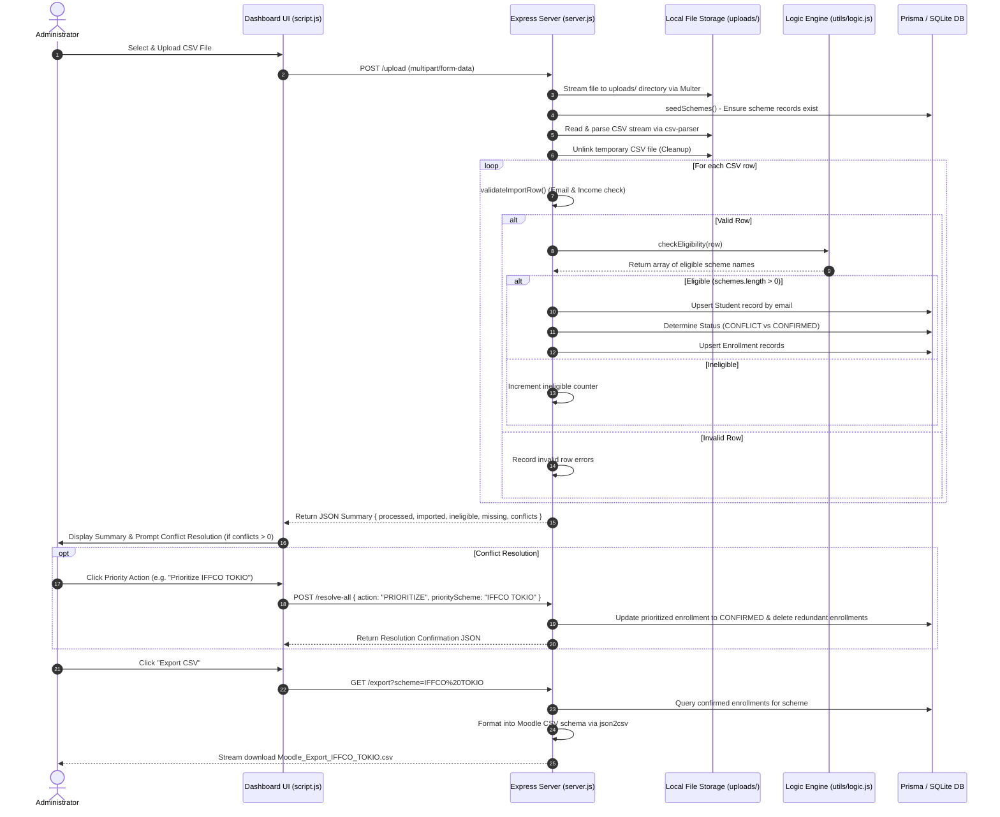
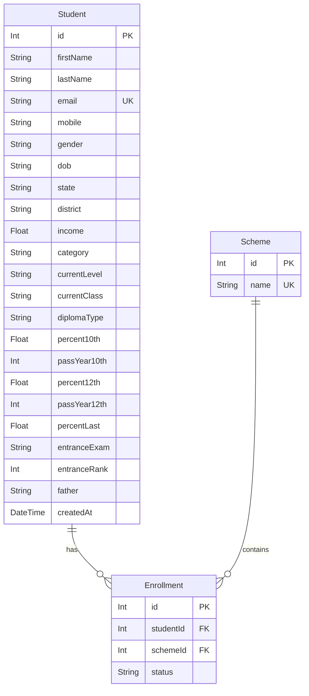

# 🎓 Scholarship Manager

[](https://nodejs.org/)
[](https://expressjs.com/)
[](https://www.prisma.io/)
[](https://www.sqlite.org/)
[](#testing)

**Scholarship Manager** is an enterprise-ready, local-first internal administrative dashboard designed to streamline scholarship intake, automated eligibility evaluation, multi-scheme conflict detection/resolution, and Moodle LMS bulk enrollment exports.

---

## 📌 Executive Summary & Purpose

Educational organizations and scholarship administrators frequently receive applicant data as unstandardized CSV spreadsheets. Reviewing hundreds of applications manually introduces human error, inconsistent decision-making, and difficulty resolving multi-eligibility overlaps.

Scholarship Manager solves this by providing a unified workflow:
1. **Bulk Intake & Data Sanitization**: Standardizes CSV header variations, strips UTF-8 BOM markers, cleans input strings, and validates data types.
2. **Rule Engine Evaluation**: Runs applicant profiles against multi-criteria eligibility logic (income limits, domicile, academic scores, entrance exam ranks).
3. **Automated Conflict Resolution**: Flags students eligible for multiple schemes and provides one-click resolution policies (e.g., scheme prioritization or multi-enrollment confirmation).
4. **Moodle LMS Export**: Generates compliant CSV files pre-formatted for seamless bulk user intake into Moodle.

---

## 🏛 System Architecture

Scholarship Manager follows a 3-tier architecture with a decoupled client layer, a Node.js/Express application service, an isolated business logic engine, and a SQLite database managed via Prisma ORM.

```mermaid
graph TD
    subgraph Client Tier "Client Layer (Browser)"
        UI["Admin Web Interface (HTML5 / CSS3 / Vanilla JS)"]
        ActivityPanel["Activity Stream & Conflict Resolution Panel"]
    end

    subgraph Service Tier "Application & Logic Layer (Node.js / Express)"
        Server["Express API Server (server.js)"]
        UploadHandler["Multer File Upload Middleware"]
        Parser["CSV Parser Stream Handler"]
        RuleEngine["Scholarship Decision Engine (utils/logic.js)"]
        SchemeConstants["Scheme Definitions (utils/schemes.js)"]
        ExportEngine["Moodle CSV Serializer (json2csv)"]
    end

    subgraph Data Tier "Persistence Layer (Prisma ORM & SQLite)"
        Prisma["Prisma Client"]
        Database[("SQLite Database (dev.db)")]
    end

    subgraph External Systems "External Ecosystem"
        CSVInput["Applicant CSV Files"]
        MoodleLMS["Moodle LMS Platform"]
    end

    CSVInput -->|HTTP POST Multipart| UploadHandler
    UploadHandler --> Parser
    Parser --> Server
    Server --> RuleEngine
    RuleEngine --> SchemeConstants
    Server --> Prisma
    Prisma --> Database
    Database --> Prisma
    Prisma --> Server
    Server --> ExportEngine
    ExportEngine -->|CSV File Stream| MoodleLMS
    UI <-->|JSON REST APIs| Server
    ActivityPanel <-->|Interactive Actions| UI
```

---

## 🔄 End-to-End Data Flow

The diagram and steps below illustrate how applicant data traverses the system from raw file upload to database persistence and Moodle export.



---

## 📋 Comprehensive Codebase Audit & Improvement Analysis

Following an end-to-end review of the repository, key architectural strengths, data model details, inconsistencies, and recommended improvements were identified:

### 1. Strengths
- **Clean Separation of Business Logic**: Eligibility rules are isolated in `utils/logic.js`, making unit testing fast and zero-side-effect (`tests/eligibility.test.js`).
- **Resource Cleanup**: Uploaded CSV files are deleted inside a guaranteed `finally` block after parsing.
- **Relational Integrity**: Prisma cascading relations and composite unique index (`@@unique([studentId, schemeId])`) prevent duplicate student-scheme enrollments.

### 2. Inconsistencies & Addressed Enhancements

| Category | Inconsistency / Observation | Impact | Resolution / Status |
| :--- | :--- | :--- | :--- |
| **Field Naming Ambiguity** | CSV headers use `snake_case` (e.g., `percent_10th`), whereas database models use `camelCase` (`percent10th`). `utils/logic.js` previously only evaluated `snake_case`. | If DB student objects were re-evaluated by `checkEligibility()`, all checks returned `false`. | **Fixed**: Added dual property lookup (`getVal`) supporting both `snake_case` and `camelCase` objects. |
| **Query Performance** | Inside the `for (const row of rows)` import loop, `persistEligibleStudent` queried scheme IDs (`prisma.scheme.findMany`) on every single iteration. | N+1 database query overhead during bulk imports. | **Fixed**: Pre-fetched scheme map during `seedSchemes()` and passed in-memory lookup map to `persistEligibleStudent()`. |
| **Data Generation Redundancy** | Both `dummy.py` and `test.py` existed in the root directory with 100% identical code. | Developer confusion regarding authoritative test data generator script. | **Documented**: Clarified that `test.py` is the primary mock dataset generator (`Comprehensive_Test_Data.csv`). |
| **Static Export Constants** | Export route `/export` hardcodes parameters like `college_name` (`'ABC College'`), `applicationyear` (`'2025-2026'`), and default initial passwords (`'ChangeMe123!'`). | Requires manual edits when deploying for different academic sessions or institutions. | **Recommendation**: Expose export default options via environment variables or UI options modal. |

---

## 🎯 Scholarship Eligibility Rules Matrix

The decision engine (`utils/logic.js`) evaluates applicants against specific criteria across four scholarship schemes:

| Criteria | IFFCO TOKIO | NSF | FFE | PRIF |
| :--- | :--- | :--- | :--- | :--- |
| **Income Limit** | $\le$ ₹3,00,000 | $\le$ ₹2,00,000 | $\le$ ₹3,00,000 | No Limit |
| **State** | Bihar | Bihar | Bihar | Any |
| **District** | Any | Any | Any | **Patna** |
| **Education Level** | School / Diploma / UG | Diploma | Undergraduate | Any |
| **Academic Marks** | 10th $\ge$ 60%, 12th $\ge$ 60% | 10th $\ge$ 80% or 12th $\ge$ 80% | 10th $\ge$ 70%, 12th $\ge$ 70% | N/A |
| **Passing Years** | Class 11 (10th: 2025)<br>Class 12 (10th: 2024)<br>UG (10th > 2023, 12th: 2025) | Diploma 10th (2025)<br>Diploma 12th (10th: 2023, 12th: 2025) | 10th (2021-2023)<br>12th (2023-2025) | N/A |
| **Entrance Exam / Rank** | N/A | DCECE Rank $\le$ 4000 | JEE Mains $\le$ 90,000<br>JEE Adv $\le$ 20,000<br>NEET $\le$ 40,000<br>BCECE $\le$ 10,000 | N/A |

---

## 💻 Tech Stack & Project Structure

### Technology Stack
- **Backend Runtime**: Node.js ($\ge$ v18.18)
- **Web Framework**: Express.js
- **Database Engine**: SQLite 3
- **ORM**: Prisma ORM v5.10
- **File Parsing & Export**: `multer`, `csv-parser`, `json2csv`
- **Frontend UI**: Vanilla HTML5, CSS3 (CSS Variables, Flexbox/Grid), JavaScript (ES6+ async/await), Lucide Icons
- **Test Framework**: Node.js Native Test Runner (`node --test`)

### Directory Layout
```text
Scholarship_Manager/
├── Comprehensive_Test_Data.csv  # 500-record sample dataset
├── README.md                    # Project documentation & guides
├── test.py                      # Python mock data generator
├── dummy.py                     # Mock data generator alias
├── package.json                 # Project configuration & scripts
├── server.js                    # Core Express server & API handlers
├── prisma/
│   ├── dev.db                   # SQLite database file
│   └── schema.prisma            # Prisma data models & relations
├── public/
│   ├── index.html               # Main dashboard HTML structure
│   ├── script.js                # Client UI interactivity & API calls
│   └── style.css                # Custom UI stylesheet
├── tests/
│   └── eligibility.test.js      # Decision engine unit tests
└── utils/
    ├── logic.js                 # Rule evaluation engine
    └── schemes.js               # Scheme constants
```

---

## ⚡ Getting Started & Setup Guide

### Prerequisites
- **Node.js**: `v18.18.0` or higher
- **npm**: `v9.0.0` or higher

### Installation

1. **Clone the repository**:
   ```bash
   git clone https://github.com/nihal1087/Scholarship_manager.git
   cd Scholarship_Manager
   ```

2. **Install Node.js dependencies**:
   ```bash
   npm install
   ```

3. **Initialize the SQLite Database**:
   ```bash
   npm run prisma:generate
   npm run db:push
   ```

4. **Start the Application**:
   ```bash
   npm start
   ```

5. **Access the Dashboard**:
   Open your browser and navigate to `http://localhost:3002`.

---

## ⚙️ Environment Variables

The server configurable variables can be set via system environment variables or a `.env` file:

| Variable | Default Value | Description |
| :--- | :--- | :--- |
| `PORT` | `3002` | Port on which the HTTP server listens. |
| `MAX_UPLOAD_BYTES` | `5242880` (5 MB) | Maximum permitted file size for incoming CSV uploads. |
| `CORS_ORIGIN` | `null` (Same-origin) | Comma-separated allowed CORS origins for external API clients. |

---

## 📡 REST API Reference

### 1. Health Check
- **`GET /health`**
  - **Response**: `{ "status": "ok" }`

### 2. Upload Applicant CSV
- **`POST /upload`**
  - **Content-Type**: `multipart/form-data`
  - **Body**: `file` (CSV File)
  - **Response**:
    ```json
    {
      "processed": 500,
      "imported": 415,
      "ineligible": 80,
      "missing": 5,
      "conflicts": 42
    }
    ```

### 3. Bulk Conflict Resolution
- **`POST /resolve-all`**
  - **Body**:
    ```json
    {
      "action": "PRIORITIZE",
      "priorityScheme": "IFFCO TOKIO"
    }
    ```
  - **Response**: `{ "success": true, "message": "42 students were assigned to IFFCO TOKIO." }`

### 4. Fetch Dashboard Summary
- **`GET /stats`**
  - **Response**: Returns list of stored students with their scheme enrollment statuses.

### 5. Fetch Scheme Specific Students
- **`GET /scheme/:name`**
  - **Params**: `:name` = `IFFCO TOKIO` | `NSF` | `FFE` | `PRIF` | `All`
  - **Response**: Array of student objects enrolled in the specified scheme.

### 6. Export Moodle CSV
- **`GET /export?scheme=IFFCO%20TOKIO`**
  - **Response**: Streams binary CSV attachment `Moodle_Export_IFFCO_TOKIO.csv`.

### 7. Clear Stored Data
- **`DELETE /clear-data`**
  - **Response**: `{ "success": true, "message": "Student and enrollment data was cleared." }`

---

## 🗄 Database Schema (Prisma)



---

## 🧪 Testing & Verification

Unit tests cover the core decision engine logic in `utils/logic.js`. Execute tests via:

```bash
npm test
```

Sample Output:
```text
✔ marks a qualifying Bihar class 11 student eligible for IFFCO TOKIO
✔ marks DCECE diploma students eligible for NSF when rank and scores qualify
✔ marks eligible engineering entrance records for FFE
✔ adds PRIF eligibility for Patna district records
✔ returns no schemes when the record does not satisfy any rule
✔ supports camelCase DB student object format for IFFCO TOKIO eligibility
ℹ tests 6 | pass 6 | fail 0
```

To generate a 500-record test dataset using Python:
```bash
python test.py
```

---

## 🔮 Future Roadmap & Improvements

- [ ] **Custom Scheme Configurator**: Dynamic UI builder for administrators to create custom eligibility rules without altering code.
- [ ] **Role-Based Access Control (RBAC)**: Authentication and authorization tiers (Admin, Auditor, Viewer).
- [ ] **Audit Trail & History**: Historical log tracking CSV import operations and manual conflict resolutions.
- [ ] **Direct LMS API Sync**: Direct integration with Moodle REST API to automatically enroll students without manual CSV downloading.

---

## 📄 License

This project is open-source under the [MIT License](LICENSE).
